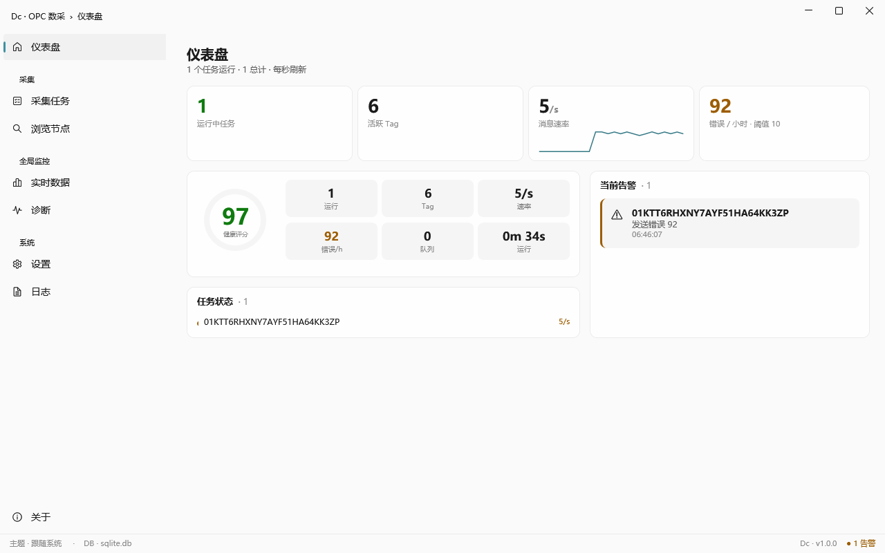
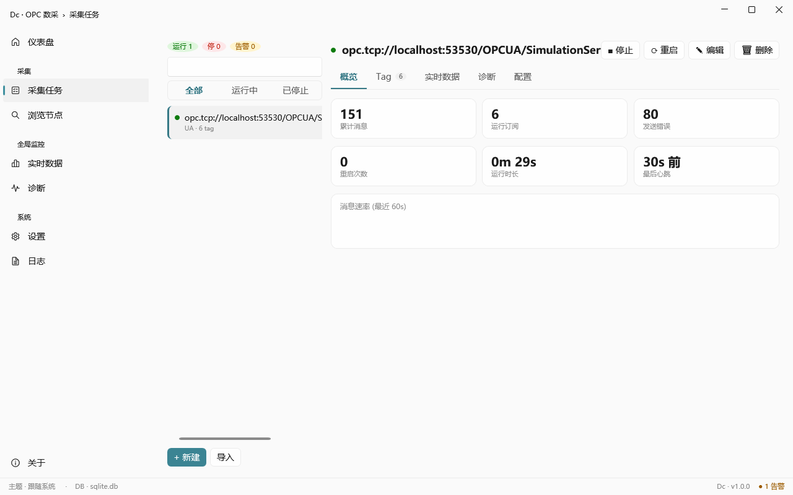
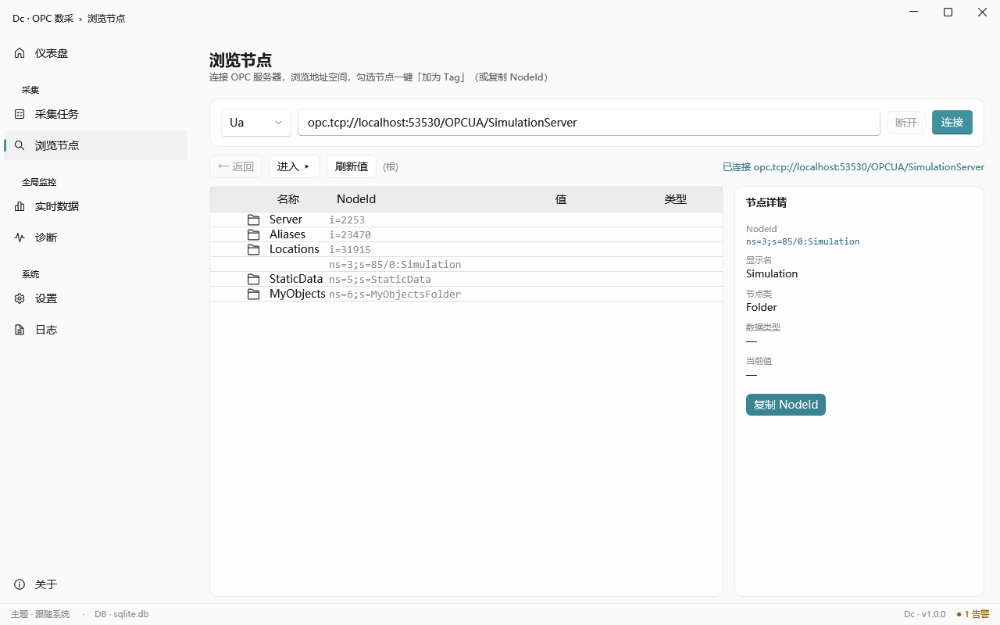
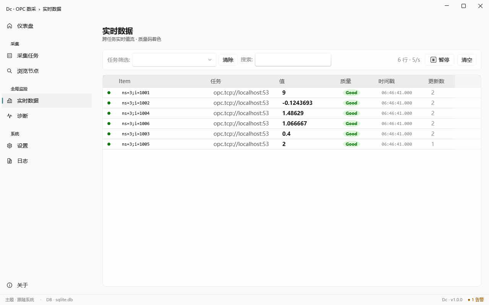
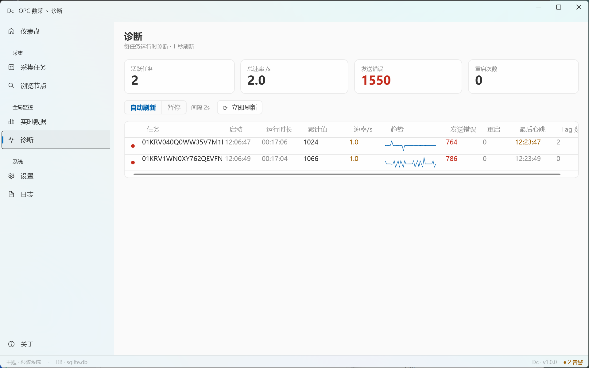
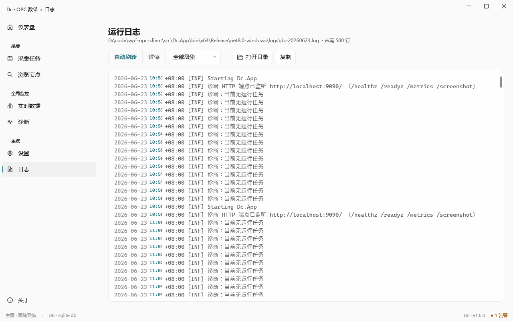
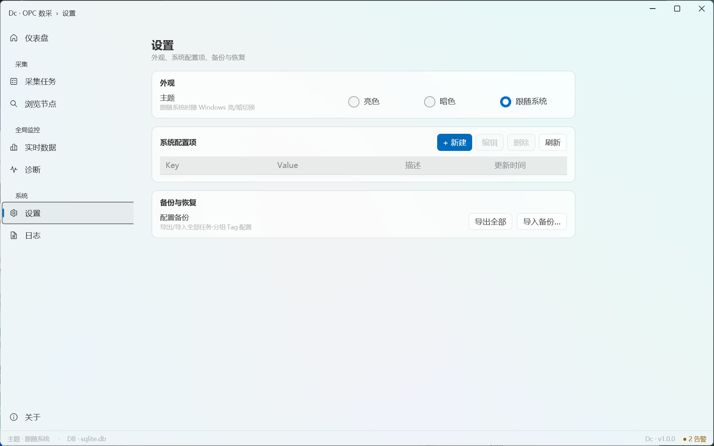

# Dc — 通用 OPC 数据采集客户端

[English](README.md) · **简体中文**

[](LICENSE)
[](https://dotnet.microsoft.com/)
[](#)
[](#)

.NET 8 实现的 OPC 数据采集客户端：浏览 OPC 地址空间、配置采集任务、实时订阅 OPC UA / DA / AE 数据，并通过 TCP 发布到下游 broker。

**核心原则**：通用、解耦、可扩展 —— 不假定特定 broker 协议、不绑定特定 OPC SDK。

两种形态共用同一套采集引擎：**Windows 桌面端**（`Dc.App`，WPF GUI，全协议 UA/DA/AE）与 **无头服务端**（`Dc.Cli`，纯 .NET，**可 Linux/Docker 部署**，UA 采集 + 发布）。

---

## 下载

最新版见 **[Releases](https://github.com/DevMinions/wpf-opc-client/releases/latest)**：

| 形态 | 产物 | 用法 | 协议 |
|---|---|---|---|
| Windows 桌面 GUI | `Dc-v<ver>-win-x64.zip` | 解压双击 `Dc.App.exe` | UA / DA / AE |
| Linux 无头采集器 | `Dc.Cli-v<ver>-linux-x64.tar.gz`（另有 `-arm64`） | 解压后 `./Dc.Cli` | 仅 UA |
| Docker 镜像 | `ghcr.io/devminions/dc-cli:<ver>`（多架构 amd64/arm64） | 见下 | 仅 UA |

均为 self-contained，**目标机无需预装 .NET 运行时**。无头端从 `sqlite.db` 读取已配置任务（可由 GUI 端配置好后共享，表结构一致）。

```bash
# Docker 跑无头采集器：把含任务的 sqlite.db 放在宿主 ./data
docker run -d --name dc-collector -v "$PWD/data:/data" ghcr.io/devminions/dc-cli:latest
docker logs -f dc-collector
```

> Windows zip/安装包未代码签名，首次运行 SmartScreen 会提示「未知发布者」→ 点「更多信息 → 仍要运行」。

---

## 界面截图

> Fluent Design · 亮/暗主题跟随系统 · 以下为 Windows 端实跑截图。



| 采集任务（master-detail + 5 tab） | 浏览节点 |
|---|---|
|  |  |
| **实时数据** | **诊断** |
|  |  |
| **运行日志** | **设置** |
|  |  |

---

## 功能

### OPC 协议与数据源

- **OPC UA** —— 订阅、浏览地址空间、**浏览时读当前值**（批量读）、证书信任链、**KeepAlive 断线自动重连**、每任务安全/None 端点开关。（OPC Foundation .NET Standard SDK。）
- **OPC DA** —— 订阅、浏览、**OPCEnum 服务器扫描 / IP 发现**、主动**探活**（`GetServerStatus`）及时发现断线。（Technosoftware DaAeHdaClient,COM/DCOM,需 Windows。）
- **OPC AE** —— 报警与事件订阅、Area/Source 浏览。（同一 SDK。）

### Tag 数据加工

- **三态质量码** —— Good / Uncertain / Bad,按 `0xC0/0x40/0x00` 位运算解析,UI 着色。
- **工程量缩放/偏移** —— 每个真实 Tag 可配**缩放系数 + 偏移**,发布前把原始值换算成工程量（raw → 工程量）。
- **虚拟测点（公式计算）** —— 一个 Tag 可定义为基于同任务其它 Tag 的**公式**（DynamicExpresso 引擎,如 `T * 1.8 + 32`;内置 `SQRT/ABS/SIN/COS/IF/MIN/MAX/AVG/SUM/...`）:在采集管道里求值,含输入映射、就绪门控、**质量传播**,与真实 Tag 一同发布。

### 任务配置（桌面端）

- **主从工作台** —— 任务列表带状态筛选（全部 / 运行中 / 已停止）+ 实时搜索;详情区 5 个标签页（概览 / Tag / 实时数据 / 诊断 / 配置）。
- **任务增删改** —— 新建/编辑/删除任务（UA/DA/AE;服务器/节点/CLSID、采样间隔、死区、下游 TCP 地址、每任务安全开关）,带用户可读名称。
- **Tag 增删改** —— 新建/编辑/删除真实或虚拟 Tag,带**引用完整性拦截**（被公式引用的 Tag 不能删;删虚拟 Tag 级联删其公式）;能安全地热同步到运行中的任务。
- **发现 → 配置** —— 浏览、多选节点,一键**「加为 Tag」**批量落到任务（数据类型自动映射）,随即跳到该任务;空状态引导到浏览页。
- **Excel 导入/导出** —— ClosedXML;导入按 Item + 数据类型落当前任务（导出另含 TaskId 列）。

### 运行引擎

- **`TaskOrchestrator`** —— 启停/重启、**不重启热增删 Tag**、心跳监控、看门狗**超时自动重启**、连接状态跟踪。
- **TCP 发布** —— 批量发送、**MessagePack / JSON** 可切换、wire 格式 v1.1（magic + format-id）、冷却重连 + 发送超时、**可选有界离线队列**（溢出丢最旧）。
- **解耦 + 泛型** —— `PublishAsync<T>` 不限定消息类型,broker 协议由部署方决定,OPC SDK 不泄漏出抽象层。

### 监控与可观测

- **仪表盘** —— 健康评分、运行/停止/告警计数、总吞吐、每任务状态一览。
- **实时数据** —— 跨任务值流、三态质量着色、任务筛选 + 搜索 + 暂停/清空、**高频合并**（每秒数千更新仍流畅）。
- **诊断** —— 每任务速率 / 发送错误 / 重启 / 心跳龄 / 队列积压 / 丢弃帧 + sparkline,刷新间隔可调;区分「无下游消费者」与真实发送错误。
- **指标与探针** —— `System.Diagnostics.Metrics` + `GET /metrics`（Prometheus `dc_collector_*`）、`GET /healthz` 与 `/readyz`;另有周期结构化诊断日志（含队列溢出丢弃边沿告警）。
- **日志** —— Serilog 滚动文件 + 应用内日志查看器。

### 部署与运维

- **两种形态、一套引擎** —— Windows 桌面（UA/DA/AE）与无头 `Dc.Cli`（Linux/Docker,仅 UA）;均 **self-contained**（目标机无需预装 .NET 运行时）。
- **配置备份/恢复** —— 把**全部任务·Tag·配置**导出/导入为 JSON（合并或替换）,以及 `appsettings.json` 外部化。
- **双语界面** —— 完整 **English / 简体中文** 界面,**运行时切换**(设置 → 语言)免重启,或**跟随系统语言**;选择持久化到 `appsettings.json`。(只切界面语言 —— 数值/日期格式与 OPC 数值解析保持稳定。)
- **桌面体验** —— Fluent UI,**亮/暗/跟随系统主题**、主题化弹窗、**实时输入校验**、系统托盘 + 单实例锁。

持久化为 EF Core + SQLite（表:任务 / Tag / 公式 / 系统配置）。路线图见 [`ROADMAP.md`](./ROADMAP.md)。

---

## 架构

Clean Architecture,依赖单向（UI → Infrastructure → Abstractions/Domain）：

```
src/
├── Dc.Domain/             # 实体（无外部依赖）
├── Dc.Opc.Abstractions/   # IOpcSubscriber / IOpcBrowser / TagValue / OpcProtocol
├── Dc.Opc.Ua/             # UA 订阅器 + 浏览器（OPC Foundation）
├── Dc.Opc.Da/             # DA 订阅器 + 浏览器（Technosoftware）
├── Dc.Opc.Ae/             # AE 订阅器 + 浏览器（Technosoftware）
├── Dc.Infrastructure/     # EF Core + 序列化 + TCP 发布 + 编排 + 诊断可观测
├── Dc.App/                # WPF 主程序（MVVM + DI,Windows）
└── Dc.Cli/                # 无头采集器（控制台,Linux/Docker,仅 UA）
tests/                     # xUnit 单元 + 集成测试（含 UA 内嵌 server 端到端）
tools/Dc.WireDump/         # 接收端调试工具（解析 wire 帧）
```

### 关键设计取舍

- **DbContext 直接用,不包 Repository** —— EF Core 本身即 Repository+UoW。
- **序列化器与 Publisher 分离 + 泛型** —— `PublishAsync<T>(T)` 不限定消息类型,broker 端协议由部署方决定。
- **`TaskOrchestrator` 单对象 API** —— 一个对象管全部任务生命周期 + 热更新 + 看门狗。
- **`IOpcSubscriber` 只暴露 `ChannelReader<T>`** —— 外部只读拉数据,订阅器内部状态不可外写。
- **质量码用 `0xC0/0x40/0x00` 位运算解析**（非 `quality > 0`）。
- **数据库列 `dc_` 前缀 + snake_case**（`EFCore.NamingConventions`）。

---

## 构建

需要 .NET 8 SDK。OPC DA/AE 依赖的 Technosoftware DA/AE/HDA 客户端源码已内置于
[`vendor/ClassicClient/`](vendor/ClassicClient)（GPL-3.0）,无需额外拉取：

```bash
git clone https://github.com/DevMinions/wpf-opc-client.git
cd wpf-opc-client
# 按工程构建（全局 Platform=x64 直传所有 P2P,含 vendor COM）
dotnet build src/Dc.App/Dc.App.csproj -p:Platform=x64 -p:CustomTestTarget=net8.0-windows
dotnet test tests/Dc.Infrastructure.Tests -p:Platform=x64 -p:CustomTestTarget=net8.0-windows
```

Windows 上可用脚本：

```powershell
.\build.ps1                 # 构建
.\build.ps1 -Target test    # 跑测试
.\build.ps1 -Target run     # 启动应用
```

**为什么需要两个 `-p` 参数**：
- `Platform=x64` —— vendor `DaAeHdaClient.Com` 的 `NETCORE` 宏只在 x86/x64 平台定义,否则编译报 `FILETIME` 找不到。
- `CustomTestTarget=net8.0-windows` —— 让 vendor 只编 net8 一份（默认编 5 个 TFM 含 net9/net10）,无对应 SDK 会 NETSDK1045。

> Linux/WSL/macOS 可**构建**非 GUI 项目并跑跨平台测试,但 **WPF 应用与 OPC DA/AE（COM）只能在 Windows 运行**。

---

## 运行

### 桌面 GUI（Windows,全协议）

```powershell
dotnet run --project src/Dc.App
```

首次运行会在工作目录创建:`sqlite.db`（空库）、`logs/dc-yyyyMMdd.log`、`pki/`（OPC UA 自签证书）。

### 采集 OPC UA

1. **采集任务 → 新建**:协议选 **UA**,服务器填 `opc.tcp://host:4840`,TCP 地址填下游 broker 的 `host:port`。
2. **浏览节点** → 输入 server URI → **连接** → 在树里勾选多个节点 → **「加为 Tag」**选目标任务（或 **+ 新建任务**）。*（或:在任务的 Tag 页点**新建**手填 Item。）*
3. 选中任务 → **启动** → 在**实时数据**看值流入。

Tag 直接挂任务,无需先建分组。

### 虚拟测点 & 工程量缩放

- **虚拟测点(公式)** —— 在 Tag 编辑器勾选**「虚拟测点(公式计算)」**,填写基于同任务其它 Tag 的表达式(如 `T * 1.8 + 32`),把每个变量映射到一个源 Tag。它在采集管道里计算,像真实 Tag 一样发布(内置 `SQRT/ABS/SIN/COS/IF/MIN/MAX/AVG/SUM/...`);结果质量由输入传播。
- **缩放** —— 真实 Tag 可填**缩放系数 + 偏移**,发布前把原始值换算成工程量。

### 采集 OPC DA / AE

需要一个 OPC DA/AE 服务器作数据源（任选其一）：
- **KEPServerEX Demo**（自带 Simulator 通道,ProgID `Kepware.KEPServerEX.V6`,2 小时重启限制）
- **Matrikon OPC Simulation Server**（免费）
- **Technosoftware Demo Server**（随其 DA/AE/HDA 客户端套件分发;本仓为精简体积未内置演示二进制）

流程:采集任务 → 协议 **DA**,节点填主机/IP（本机 `localhost`）,ProgID 填 server 的 ProgID;浏览节点页协议选 DA 会出现「扫描 OPC 服务器」栏,扫到后自动回填。

> 跨机 DA 依赖 OPCEnum + DCOM 权限,配置较繁琐,建议先用本机 demo server 走通流程。

### 无头运行（Linux / Docker,仅 UA）

`Dc.Cli` 不依赖 WPF,从同一套 `sqlite.db` 加载已配置任务,跑 UA 采集 + TCP 发布——适合服务器/边缘常驻。DA/AE 走 COM 需 Windows,无头端不含。

```bash
# tarball（自带运行时,无需装 .NET）
tar xzf Dc.Cli-v<ver>-linux-x64.tar.gz && ./Dc.Cli

# 或 Docker（含任务的 sqlite.db 放宿主 ./data 卷,Database__Path 已指向 /data;9090 为诊断端口）
docker run -d --name dc-collector -v "$PWD/data:/data" -p 9090:9090 ghcr.io/devminions/dc-cli:latest
```

任务库 `sqlite.db` 可由 Windows GUI 端配置好后拷贝/共享给无头端（表结构一致）。日志走 stdout（`docker logs` 可见）,`Ctrl+C` / `docker stop` 优雅关停。源码运行:`dotnet run --project src/Dc.Cli`。

**诊断端点**（默认监听 `:9090`,可经 `Diagnostics:Http` 配置/关闭）：

| 路径 | 用途 |
|---|---|
| `GET /healthz`、`/readyz` | 存活/就绪探针（Docker `HEALTHCHECK` 与 k8s 直接可用） |
| `GET /metrics` | Prometheus 文本,导出 `dc_collector_*`（运行任务数、每任务值数/发布错误/重启/订阅 Tag 数/心跳龄/队列积压字节/累计丢弃帧数） |

镜像内置 `HEALTHCHECK`（调用 `Dc.Cli --healthcheck` 探 `/healthz`,无需镜像装 curl）。

> ⚠️ `/metrics` **无鉴权**且默认绑全网卡（`http://+:9090/`）,仅暴露给受信抓取网络（Prometheus / k8s）,**勿把 9090 直接映射公网**;不需要可经 `Diagnostics:Http:Enabled=false` 关闭。
> 镜像以非 root（uid 10001）运行:用 `-v` 绑定宿主目录时,该目录需对 uid 10001 可写（`chown -R 10001 ./data`,或 `docker run --user` 调整）。

### 配置

同目录 `appsettings.json` 可外部化（无需重编译）：

```json
{
  "Database": { "Path": "sqlite.db" },
  "Theme": "System",
  "Language": "System",
  "Messaging": { "Format": "msgpack" },
  "Orchestrator": { "WatchdogIntervalSeconds": 30, "HeartbeatTimeoutSeconds": 120 },
  "Diagnostics": {
    "ReportIntervalSeconds": 30, "EnableLogging": true, "EnableMetrics": true,
    "Http": { "Enabled": true, "Prefix": "http://+:9090/" }
  },
  "OpcUa": { "AutoAcceptUntrustedCertificates": false, "MinimumCertificateKeySize": 2048 }
}
```

---

## 打包安装包

需装 [Inno Setup 6](https://jrsoftware.org/isdl.php)（默认路径,或设环境变量 `INNO_SETUP_DIR`）。

```powershell
.\build.ps1 -Target installer                 # 出 build/installer/Dc-Setup-x64-<version>.exe
.\build.ps1 -Target installer -Version 1.2.3
```

产出 self-contained 安装包（用户机不需预装 .NET 运行时）,含发布产物 + 脚本 + 文档 + LICENSE。安装时自动检测 OPCEnum,缺失会提示安装 OPC Foundation Core Components。

> 未带:代码签名（产线建议 EV 证书避免 SmartScreen）、MSI 格式、自动更新。

### 发布产物（CI 自动）

推送 `v*` tag 触发 [`release.yml`](.github/workflows/release.yml),自动构建并挂到同一个 GitHub Release：

- **Windows** — `Dc.App` self-contained zip
- **Linux** — `Dc.Cli` self-contained 单文件 tarball（x64 / arm64）
- **Docker** — 多架构镜像（amd64 / arm64）推送到 GHCR `ghcr.io/<owner>/dc-cli`（`<ver>` + `latest`）

```bash
git tag v1.2.3 && git push origin v1.2.3
```

> GHCR 镜像首次推送默认**私有**,需在 GitHub Packages 设置里将 `dc-cli` 包设为 public 才能匿名 `docker pull`。

---

## OPC UA 证书管理

默认安全基线:`AutoAcceptUntrustedCertificates = false`、`MinimumCertificateKeySize = 2048`。

首次连接陌生 UA server 会被拒绝,其证书写入 `pki/rejected/certs/`。人工审核后移到 `pki/trusted/certs/`,重启即可连接。

| 目录 | 内容 |
|---|---|
| `pki/own/` | 客户端自己的证书（自动生成） |
| `pki/trusted/` | 信任的 server 证书（人工放入） |
| `pki/issuer/` | 信任的 CA 颁发者证书 |
| `pki/rejected/` | 被拒证书（供审核） |

dev 环境可设 `"AutoAcceptUntrustedCertificates": true` 跳过（不推荐用于生产）。

每个 UA 任务还有独立的**「使用安全连接」**开关:开 = 选最高安全端点（需双向证书信任）,关 = 直连 None 端点（免证书,适合模拟器/dev server）。默认**开**(产线安全优先)。

---

## 已知限制

- **远程 DA 发现/连接受 DCOM 配置约束** —— 跨机 DA 强依赖 OPCEnum + DCOM 权限。
- **TCP Publisher 单连接** —— 带 2s 重连冷却 + 发送超时;离线队列为可选（默认关）。
- **MessagePack 不带类型信息** —— 接收端需知消息类型,见 [`docs/wire-format.md`](docs/wire-format.md)。
- **安装包未代码签名** —— SmartScreen 严格环境首次运行会拦截。

---

## 贡献

欢迎 issue 与 PR。提交前请确保 `dotnet test tests/Dc.Infrastructure.Tests` 通过。详见 [CONTRIBUTING.md](CONTRIBUTING.md)。

## License

**GPL-3.0**（见 [LICENSE](LICENSE)）。

项目依赖的 `OPCFoundation.NetStandard.Opc.Ua.Client` 与 `Technosoftware.DaAeHdaClient` 均为 GPL / 商业双轨许可,非购买方默认走 GPL,因此本项目整体以 GPL-3.0 分发——**任何人可自由使用、修改、再分发,但衍生作品须同样开源（GPL）**。如需闭源商用,需分别购买 OPC Foundation 与 Technosoftware 的商业许可。

第三方依赖完整许可证清单见 [THIRD_PARTY_NOTICES.md](THIRD_PARTY_NOTICES.md)。
